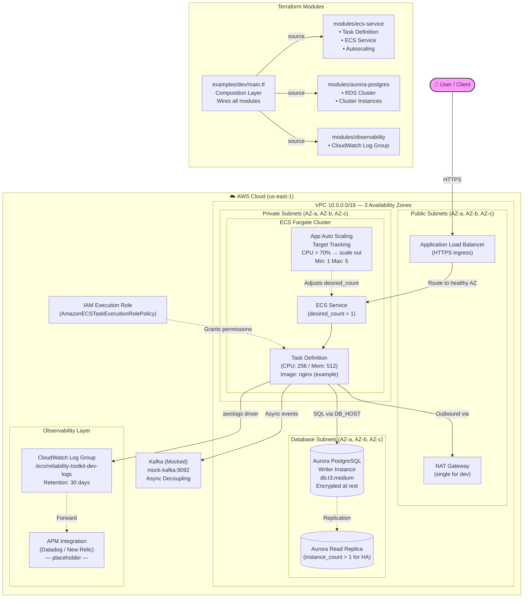
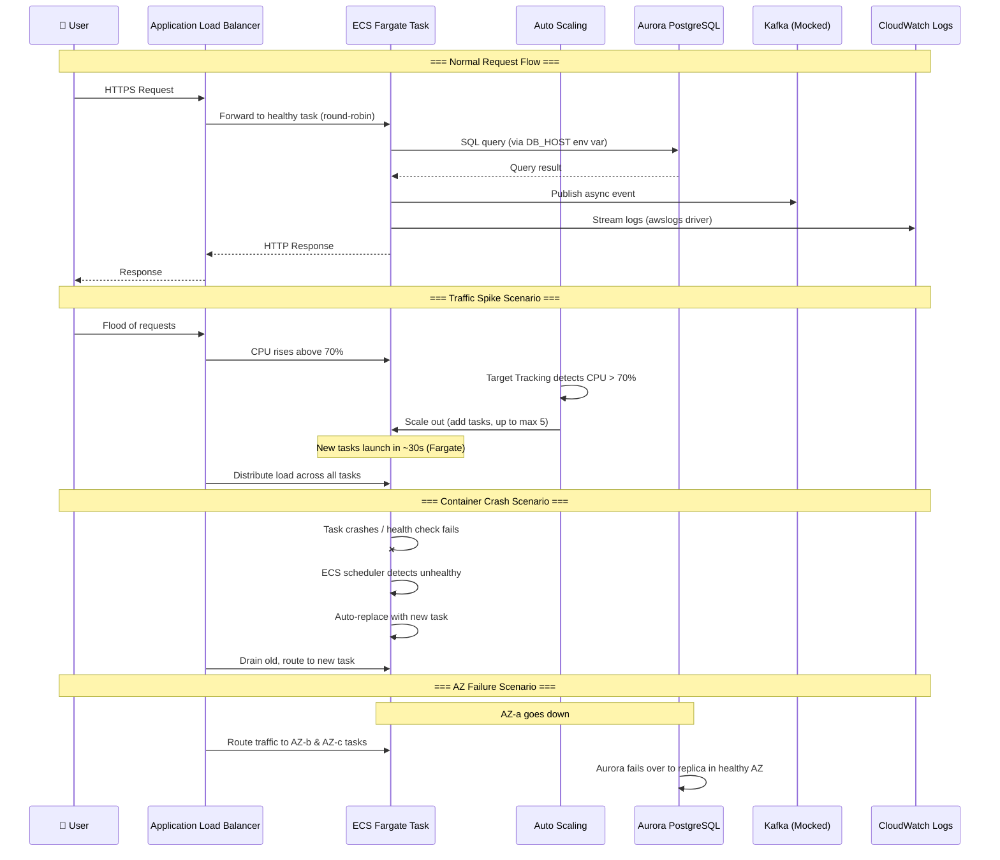
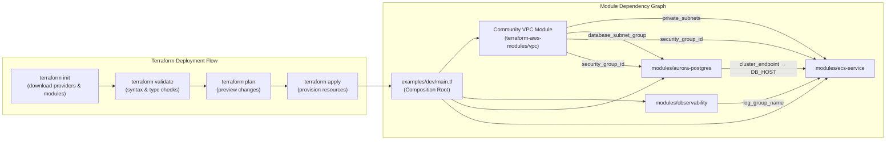

# Interview Prep — Cloud Infrastructure Reliability Toolkit

> **This file is git-ignored. It is your personal reference for explaining the project in interviews.**

---

## Architecture Diagrams

### 1. Full Infrastructure Architecture



### 2. Request Flow & Failure Scenarios



### 3. Terraform Module Dependencies & Deployment Flow



---

## Elevator Pitch (30 seconds)

> "I built a Cloud Infrastructure Reliability Toolkit — a set of modular Terraform configurations that provision a fault-tolerant, auto-scaling application stack on AWS. It deploys ECS Fargate containers behind an ALB, backed by Aurora PostgreSQL, across three Availability Zones. The key idea is that reliability patterns — autoscaling, self-healing, Multi-AZ failover, encrypted storage, and centralized logging — are baked into the infrastructure code itself, not bolted on as an afterthought."

---

## Extended Explanation (2–3 minutes)

### What does the project do?

"This project provisions a complete, production-grade application infrastructure on AWS using Terraform. Instead of clicking through the AWS console, the entire environment — networking, compute, database, and monitoring — is defined as code in reusable modules."

### What's the architecture?

"Traffic enters through an Application Load Balancer in public subnets. The ALB forwards requests to ECS Fargate containers running in private subnets — they have no public IP, so they're not directly reachable from the internet. The containers talk to an Aurora PostgreSQL database that sits in an even more isolated layer — dedicated database subnets. Every log line is automatically streamed to CloudWatch via the awslogs driver. There's also a mocked Kafka dependency representing async event processing to prevent cascading failures."

### How is it structured?

"I structured it into three reusable Terraform modules:

1. **ecs-service** — deploys a Fargate task definition, an ECS service, and a CPU-based autoscaling policy. When CPU crosses 70%, AWS adds more containers automatically, up to a max of 5.
2. **aurora-postgres** — provisions an Aurora PostgreSQL cluster. It's parameterized so you can pass `instance_count = 1` for dev and `instance_count = 2+` for production HA with automatic failover. Storage is always encrypted.
3. **observability** — creates a CloudWatch Log Group with configurable retention and has a placeholder for APM integration like Datadog.

A composition layer (`examples/dev/main.tf`) wires these modules together. It also creates the VPC using a well-known community module, sets up three AZs, and creates the IAM execution role for ECS."

### What happens when things fail?

"Three scenarios:

- **Container crash** — ECS detects the unhealthy task and automatically replaces it. No pager needed.
- **AZ goes down** — The ALB stops routing to the failed AZ and sends traffic to the other two. Aurora fails over to a read replica automatically.
- **Traffic spike** — The autoscaling policy detects CPU > 70% and launches additional Fargate tasks in about 30 seconds. When traffic subsides, it scales back down to save costs."

### Why Terraform?

"Immutable infrastructure. If an environment is corrupted, I can `terraform destroy` and `terraform apply` to get an identical environment in minutes. Everything is version-controlled, peer-reviewed, and reproducible. The CI pipeline runs `terraform validate` and `terraform plan` to catch drift before it reaches production."

---

## Common Interview Questions & Answers

### Q: Why did you choose ECS Fargate instead of EC2 or EKS?

"Fargate eliminates server management entirely — no patching, no capacity planning for the underlying hosts. For this use case, I didn't need the flexibility of EKS (which introduces Kubernetes operational complexity) or raw EC2 (which requires managing AMIs and scaling groups). Fargate gives serverless containers with minimal operational overhead, and the autoscaling policy handles capacity automatically."

### Q: Why Aurora PostgreSQL and not standard RDS?

"Aurora's storage layer is fundamentally different — it replicates data 6 ways across 3 AZs automatically at the storage level. Standard RDS relies on synchronous replication to a standby, which is slower during failover. Aurora also provides self-healing storage — it continuously scans data blocks and repairs corruption. For a reliability-focused project, this was the natural choice."

### Q: How do you handle secrets?

"In the dev example, I use a default password in `variables.tf` for convenience — it's marked as `sensitive` so Terraform redacts it from plan output. In production, you'd use one of three approaches: a `terraform.tfvars` file (which is git-ignored), environment variables (`TF_VAR_db_password`), or AWS Secrets Manager with the ECS task definition's `secrets` block that pulls values at container start time."

### Q: How does the autoscaling work exactly?

"I use Application Auto Scaling with a Target Tracking policy. The metric is `ECSServiceAverageCPUUtilization`. I set the target value to 70%. AWS manages both scale-out and scale-in:

- When average CPU exceeds 70%, it increases the `desired_count` by adding Fargate tasks (up to max 5).
- When CPU drops back down, it gradually reduces tasks (down to min 1).

The scaling is smooth because Target Tracking aims to *maintain* the metric at 70%, not just react to crossing the threshold."

### Q: What's the role of the composition layer?

"`examples/dev/main.tf` acts as the composition root — it's the glue. It instantiates each module and passes outputs between them. For instance:

- VPC outputs `private_subnets` → fed into the ECS module as `subnet_ids`
- VPC outputs `database_subnet_group_name` → fed into the Aurora module
- Observability outputs `log_group_name` → injected into the ECS module's `log_configuration`
- Aurora outputs `cluster_endpoint` → injected as the `DB_HOST` environment variable in ECS

This means modules stay decoupled. You could swap Aurora for a different database module without touching the ECS module — just change what you pass as `DB_HOST`."

### Q: How would you extend this for production?

"Several changes:

1. **Multi-NAT** — remove `single_nat_gateway = true` so each AZ gets its own NAT for redundancy.
2. **Aurora HA** — set `instance_count >= 2` to enable automatic failover.
3. **Secrets Manager** — replace the default password with a Secrets Manager reference.
4. **ALB** — attach a proper ALB with health checks and a target group (the ECS module already supports it via the `target_group_arn` variable).
5. **Remote state** — add an S3 backend with DynamoDB state locking.
6. **CIDR / DNS** — configure Route 53, ACM certificates for HTTPS.
7. **APM** — uncomment the Datadog/New Relic forwarder in the observability module."

### Q: What's the MTTR story?

"Mean Time To Recovery is minimized in three ways:

1. **Self-healing** — ECS replaces crashed containers in seconds. Aurora fails over in under 30 seconds.
2. **Reproducibility** — because everything is IaC, a destroyed environment can be fully recreated with `terraform apply` in 5–10 minutes.
3. **Observability** — logging is provisioned alongside the application, not as an afterthought. When an incident occurs, there are no blind spots."

### Q: What metrics are you tracking?

| Metric | Where | Threshold / Value |
|---|---|---|
| `ECSServiceAverageCPUUtilization` | ECS autoscaling policy | Target: 70% |
| ECS `desired_count` | Service scheduler | Min: 1, Max: 5 |
| Aurora backup retention | RDS cluster | 7 days |
| CloudWatch log retention | Log group | 30 days |

### Q: What's the security posture?

"Defense in depth:

- **Network isolation** — three subnet tiers. Only the ALB is in public subnets. Containers and databases are never directly internet-accessible.
- **Encryption at rest** — Aurora has `storage_encrypted = true` enforced at the module level.
- **No hardcoded secrets** — database password is marked `sensitive` in Terraform. Production would use Secrets Manager.
- **Least privilege** — the ECS execution role only has `AmazonECSTaskExecutionRolePolicy`, not admin access.
- **Private containers** — `assign_public_ip = false` by default. Outbound traffic goes through the NAT gateway."

---

## Key Numbers to Remember

| Item | Value |
|---|---|
| Availability Zones | 3 |
| VPC CIDR | `10.0.0.0/16` |
| Fargate CPU / Memory | 256 / 512 |
| Autoscaling range | 1–5 tasks |
| CPU scale-out threshold | 70% |
| Aurora engine | PostgreSQL 15.4 |
| Aurora instance class | `db.t3.medium` |
| Backup retention | 7 days |
| Log retention | 30 days |
| Terraform version | >= 1.5 |
| AWS provider version | >= 5.0 |

---

## Terminology Cheat Sheet

| Term | What It Means in This Project |
|---|---|
| **Fargate** | AWS serverless container engine — you define the container, AWS manages the server |
| **Target Tracking** | Autoscaling policy type that maintains a metric at a target value (like a thermostat) |
| **Aurora** | AWS-managed relational database with 6-way storage replication and automatic failover |
| **awsvpc** | ECS networking mode where each task gets its own ENI (network interface) and private IP |
| **Composition root** | The Terraform file that instantiates and wires together all modules |
| **NAT Gateway** | Allows private subnet resources to reach the internet without being publicly accessible |
| **MTTR** | Mean Time To Recovery — how fast you can restore service after a failure |
| **Drift detection** | Comparing actual cloud state against the Terraform code to find unauthorized changes |
| **Immutable infrastructure** | Instead of modifying servers in place, you replace them entirely with new ones |

---

## Production-Readiness Deep Dive

### Why Secrets Manager Matters in Production

**The problem it solves:**

In dev, passing a database password as a Terraform variable is tolerable. In production, it is a material security risk:

- `terraform.tfstate` stores resource attributes in plaintext JSON — including every variable value. Anyone with read access to the state file (S3, local disk, CI artifact) sees the password.
- The ECS task definition is stored in the AWS API as a JSON document. If `environment` blocks contain plaintext credentials, they are visible in the ECS console, `describe-task-definition` API calls, and CloudTrail logs.
- Terraform plan output displays variable values unless every consumer is marked `sensitive`. Missing a single reference leaks the credential to CI logs.

**How this project solves it:**

Credentials are written to Secrets Manager once at `terraform apply` time. The ECS task definition references them by ARN with JSON-key extraction:

```json
"secrets": [
  { "name": "DB_PASSWORD", "valueFrom": "arn:aws:secretsmanager:...:password::" }
]
```

At task launch, the ECS agent calls `secretsmanager:GetSecretValue` using the execution role, resolves the value, and injects it as an in-memory environment variable inside the container. The credential never appears in the task definition JSON, CloudWatch Logs, or `terraform show` output.

The execution role's inline policy restricts `secretsmanager:GetSecretValue` to exactly the two secret ARNs in that environment. A compromised role credential cannot read secrets from other environments, other applications, or other AWS accounts.

`lifecycle.ignore_changes` on `secret_string` means Terraform will not revert a password that was rotated via the AWS CLI, a Lambda rotation function, or the Secrets Manager console.

**Interview-ready framing:**

> "We eliminated all plaintext credentials from the Terraform state and ECS task definitions by integrating AWS Secrets Manager with JSON-key extraction. The ECS agent resolves secrets at task launch time. IAM policy scoping ensures each environment can only access its own secrets — a compromised execution role in dev cannot read production credentials."

---

### Why Remote State Is Critical for Team Collaboration

**The problem it solves:**

Terraform's default local state creates three production risks:

1. **No concurrency control.** Two engineers running `terraform apply` simultaneously will read the same state, compute conflicting plans, and corrupt the state file. Recovery requires manual state surgery.
2. **No single source of truth.** Each developer's laptop holds a different `terraform.tfstate`. Resource drift accumulates silently. One engineer's apply may destroy resources another engineer created.
3. **No auditability.** Local state is not versioned. If a `terraform destroy` wipes production, there is no history to roll back to.

**How this project solves it:**

A dedicated `bootstrap/` workspace provisions the shared backend infrastructure:

- **S3 bucket** — versioned, encrypted (AES-256), public access blocked, `DenyInsecureTransport` policy. Bucket name includes the AWS account ID for global uniqueness.
- **DynamoDB table** — `LockID` attribute. Before any state-mutating operation, Terraform writes a lock record. A concurrent apply sees the lock and exits with an error. The lock is released when the operation completes.
- **State isolation** — dev and prod share one bucket but use different key paths (`reliability-toolkit/dev/terraform.tfstate` vs `reliability-toolkit/prod/terraform.tfstate`). The DynamoDB lock uses the full key as the `LockID`, so the two environments can never acquire each other's lock.

Migration is non-destructive: `terraform init` detects the new backend and offers to copy existing local state. Verified with `terraform state list`.

**Interview-ready framing:**

> "We provision the remote state backend via a dedicated bootstrap workspace — an S3 bucket with versioning and encryption, plus a DynamoDB table for distributed locking. This eliminates concurrent-apply state corruption, gives us a single source of truth across the team, and provides a 90-day version history for state recovery. Dev and prod are isolated by key path within the same bucket."

---

### How ALB Improves Resilience and Traffic Management

**The problem it solves:**

Without a load balancer, ECS tasks in private subnets are unreachable from the internet. There is no health checking, no traffic distribution, no TLS termination, and no graceful connection draining during deployments.

**How this project solves it:**

The ALB module provisions:

- **Multi-AZ distribution.** ALB nodes are deployed across all 3 public subnets. If an AZ fails, ALB stops routing to targets in that AZ automatically. Healthy AZs absorb the traffic — no manual intervention, no DNS changes.
- **Health-checked target group.** Each ECS task IP is registered as a target. The ALB probes `/health` every 30 seconds. After 3 consecutive failures, the target is removed from rotation. After 2 successes, it is re-added. This prevents user-facing errors from reaching unhealthy containers.
- **TLS termination.** In production, port 443 uses `ELBSecurityPolicy-TLS13-1-2-2021-06` (TLS 1.2 and 1.3 only, forward secrecy via ECDHE). Port 80 returns a 301 redirect to HTTPS. Traffic between the ALB and ECS travels over the private VPC network.
- **Graceful deployments.** `deregistration_delay = 30s` gives in-flight requests time to complete before a draining task is deregistered. Combined with the ECS deployment circuit breaker and `deployment_minimum_healthy_percent = 100`, rolling updates achieve zero downtime.
- **Security.** `drop_invalid_header_fields = true` blocks HTTP request smuggling. The ALB security group restricts egress to the ECS security group on the container port only — no lateral movement.

**Interview-ready framing:**

> "The ALB spans all 3 AZs in public subnets, providing automatic fault isolation — if an AZ goes down, traffic shifts to the remaining two with no DNS changes. TLS 1.2+ terminates at the ALB with a strict security policy, and the HTTP listener forces a permanent redirect. Health checks remove unhealthy tasks from rotation within 90 seconds, and 30-second deregistration delay ensures zero dropped connections during deployments."

---

## Additional Interview Questions (Production Upgrades)

### Q: Walk me through how a database credential gets from Terraform to a running container.

"During `terraform apply`, the secrets module writes the username and password as a JSON blob to Secrets Manager. The ECS task definition references this secret by ARN with a JSON-key suffix — for example, `arn:...:password::` extracts just the `password` field. When ECS launches a task, the agent calls `secretsmanager:GetSecretValue` using the execution role, resolves the value, and injects it as an environment variable inside the container. The task definition itself only stores the ARN reference, not the credential. If someone runs `aws ecs describe-task-definition`, they see the ARN — not the password."

### Q: What happens if someone rotates the database password outside Terraform?

"The secret version in Secrets Manager updates, but Terraform does not revert it — because we use `lifecycle { ignore_changes = [secret_string] }` on the secret version resource. The next ECS task that launches will automatically pick up the new password because the ARN hasn't changed. Existing running tasks continue using the old password until they are replaced during a deployment. For true zero-downtime rotation, you would use RDS managed rotation with a Lambda function that updates both the secret and the Aurora cluster simultaneously."

### Q: Why not just use SSM Parameter Store instead of Secrets Manager?

"Parameter Store's `SecureString` is free and works well for simple key-value secrets. Secrets Manager adds three things we need at scale: native JSON-key extraction in ECS task definitions (no Lambda resolver needed), built-in automatic rotation with AWS-managed Lambda functions, and a `recovery_window_in_days` safety net against accidental deletion. The cost difference — $0.40/secret/month — is negligible against a credential leak incident."

### Q: Explain the remote state locking mechanism.

"When `terraform plan` or `apply` starts, it writes a lock record to the DynamoDB table keyed by the full S3 key path. If another process attempts to lock the same key, DynamoDB's conditional write fails and Terraform exits with a lock conflict error. When the operation completes, the lock is released. If a process crashes mid-operation, the stale lock can be cleared with `terraform force-unlock <lock-id>`. The S3 bucket has versioning, so even a corrupted write can be rolled back to a previous version."

### Q: How does the ALB handle an AZ failure?

"The ALB does cross-zone load balancing by default. It monitors the health of registered targets in each AZ. When targets in a failing AZ stop responding to health checks (3 consecutive failures, ~90 seconds), the ALB stops routing to them. Traffic redistributes to healthy targets in the remaining AZs. On the ECS side, the service scheduler detects that tasks in the failed AZ are unhealthy and launches replacements in healthy AZs. Aurora handles it independently — automatic failover promotes a read replica in a healthy AZ to writer. The entire recovery is automated with no operator intervention."

### Q: What is the blast radius if the S3 state bucket is accidentally deleted?

"The bucket has `force_destroy = false`, so `terraform destroy` of the bootstrap workspace will fail if the bucket contains objects — which it always will. Versioning means even if individual state files are overwritten, the previous versions are recoverable. The `DenyInsecureTransport` policy prevents non-TLS access. The public access block prevents S3 bucket policy misconfiguration from exposing state files. For defense in depth, the bootstrap workspace's own state should be stored securely — either committed to a private encrypted repository or backed up to a separate account."

---

## Updated Key Numbers

| Item | Dev | Prod |
|---|---|---|
| Availability Zones | 3 | 3 |
| NAT Gateways | 1 (cost saving) | 3 (per-AZ redundancy) |
| ECS Autoscaling Range | 1\u20133 tasks | 2\u201310 tasks |
| Aurora Instances | 1 (writer only) | 2 (writer + read replica) |
| ALB Listeners | HTTP only (port 80) | HTTPS (443) + HTTP redirect (80) |
| TLS Policy | None | TLS 1.2+ (`ELBSecurityPolicy-TLS13-1-2-2021-06`) |
| Secret Recovery Window | 0 days (force delete) | 30 days |
| State Backend | S3 + DynamoDB | S3 + DynamoDB |
| State Locking | DynamoDB `LockID` | DynamoDB `LockID` |
| Deletion Protection (ALB) | `false` | `true` |
| Deletion Protection (Aurora) | `false` | `true` |
