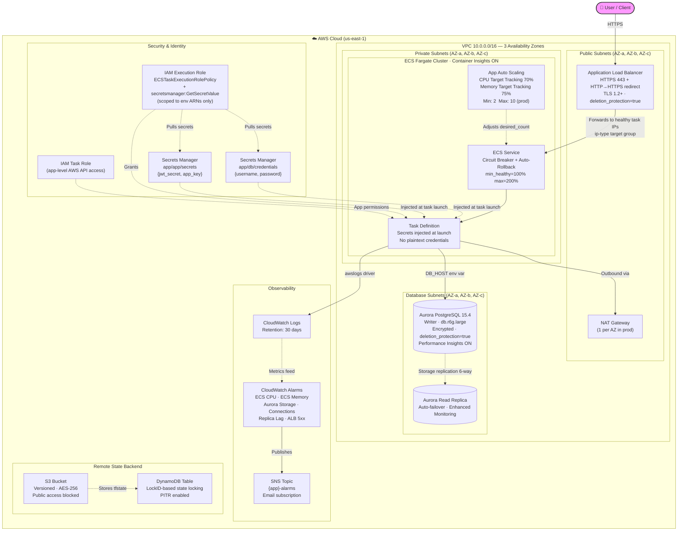
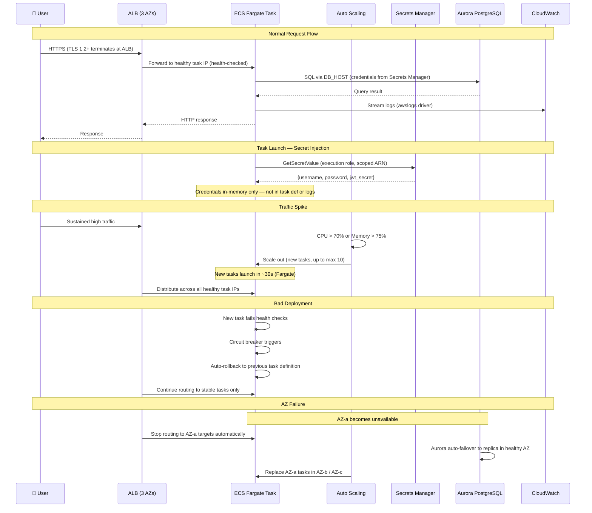
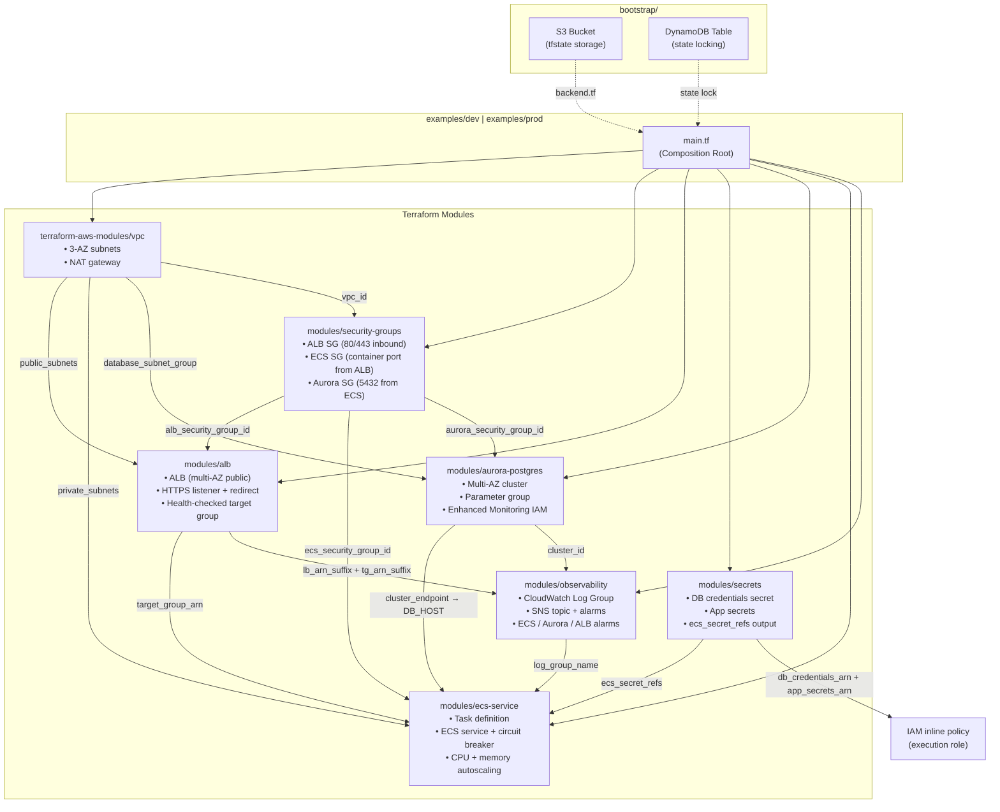

# Cloud Infrastructure Reliability Toolkit


A modular Terraform toolkit for provisioning **fault-tolerant, auto-scaling cloud infrastructure** on AWS. Built around production reliability patterns including Multi-AZ redundancy, automated recovery, and infrastructure-as-code reproducibility.

---

## Overview

This project codifies cloud reliability best practices into reusable Terraform modules. It provisions a complete application stack — networking, compute, database, and observability — with self-healing and horizontal scaling built in from the ground up.

The architecture targets a three-tier topology deployed across three AWS Availability Zones:

- **Network layer** — VPC with isolated public, private, and database subnet tiers
- **Compute layer** — ECS Fargate with CPU-based Target Tracking autoscaling
- **Data layer** — Aurora PostgreSQL with encrypted storage, automated backups, and read-replica failover
- **Observability layer** — CloudWatch log aggregation with APM integration points

---

## Architecture

### Infrastructure Overview



### Request Flow & Failure Scenarios



### Module Dependency Graph



---

## Modules

### `modules/ecs-service`

Deploys a containerized workload on ECS Fargate with production-grade defaults.

| Capability | Detail |
|---|---|
| Compute | AWS Fargate (serverless containers) — no EC2 instance management |
| Networking | `awsvpc` mode; tasks placed in private subnets with no public IP |
| Autoscaling | Target Tracking on `ECSServiceAverageCPUUtilization` (default threshold: 70%, range: 1–5 tasks) |
| Logging | Native `awslogs` driver integration with CloudWatch |
| Load Balancing | Optional ALB target group attachment via dynamic block |
| Configuration | Environment variables and Secrets Manager/Parameter Store references injected at task level |

### `modules/aurora-postgres`

Provisions an Aurora PostgreSQL cluster parameterized for both development and production topologies.

| Capability | Detail |
|---|---|
| Engine | Aurora PostgreSQL 15.4 |
| High Availability | Configurable instance count — single instance for dev, multi-instance with read replicas for production |
| Encryption | Storage encrypted at rest (enforced, non-optional) |
| Backups | Automated daily backups with configurable retention (default: 7 days, window: 07:00–09:00 UTC) |
| Network Isolation | Deployed into dedicated database subnets; `publicly_accessible` defaults to `false` |

### `modules/observability`

Manages centralized logging and alerting infrastructure with extension points for third-party APM.

| Capability | Detail |
|---|---|
| Log Aggregation | CloudWatch Log Group with validated retention period |
| Alarm Notifications | SNS topic with optional email subscription |
| ECS Alarms | CPU utilization and memory utilization threshold alarms |
| Aurora Alarms | Free storage space, connection count, and replica lag alarms |
| ALB Alarms | HTTP 5xx error rate alarm |
| APM Integration | Scaffold for Datadog/New Relic forwarder (CloudFormation stack placeholder) |

### `modules/security-groups`

Provisions dedicated, least-privilege security groups for each network tier.

| Security Group | Ingress | Egress |
|---|---|---|
| ALB | 80, 443 from `0.0.0.0/0` | Container port → ECS SG only |
| ECS Tasks | Container port from ALB SG only | 5432 → Aurora SG; 443 → internet (ECR/CloudWatch) |
| Aurora | 5432 from ECS SG only | None required |

### `modules/alb`

Provisions a production-ready Application Load Balancer with conditional TLS termination.

| Capability | Detail |
|---|---|
| Load Balancer | Internet-facing ALB across public subnets (multi-AZ) |
| TLS | HTTPS listener with `ELBSecurityPolicy-TLS13-1-2-2021-06` (TLS 1.2+); HTTP→HTTPS 301 redirect |
| Dev mode | When `certificate_arn` is empty, creates an HTTP-only listener (no TLS) |
| Target Group | `target_type = "ip"` for Fargate `awsvpc`; 30s deregistration delay |
| Health Check | Configurable path, interval, thresholds, and matcher |
| Access Logs | Optional S3 access log delivery for audit and compliance |
| Safety | `enable_deletion_protection` variable (default `true` in prod) |

### `modules/secrets`

Manages application and database credentials in AWS Secrets Manager with ECS-native integration.

| Capability | Detail |
|---|---|
| DB Credentials | JSON secret at `<app_name>/db/credentials` storing `{username, password}` |
| App Secrets | JSON secret at `<app_name>/app/secrets` storing JWT keys, API tokens |
| ECS Integration | `ecs_secret_refs` output maps directly to the task definition `secrets` block |
| Rotation Safety | `lifecycle.ignore_changes` on `secret_string` prevents Terraform from reverting out-of-band rotations |
| Recovery | Configurable `recovery_window_in_days`: 0 for dev (force delete), 7–30 for production |

---

## Reliability Design

### Fault Isolation

Services, databases, and load balancers are distributed across three Availability Zones in separate subnet tiers with independent security groups. A failure in any single AZ does not propagate to the remaining zones.

### Self-Healing Compute

The ECS service scheduler continuously monitors task health. Unhealthy tasks are drained and replaced automatically without operator intervention.

### Elastic Scaling

Application Auto Scaling uses a Target Tracking policy on average CPU utilization. When the metric exceeds the configured threshold (default 70%), additional Fargate tasks are launched. Scale-in occurs automatically when demand subsides.

### Data Durability & Failover

Aurora PostgreSQL replicates data six ways across three AZs at the storage layer. When provisioned with multiple instances, automatic failover promotes a read replica to primary in the event of a writer failure.

### Async Decoupling

The architecture supports asynchronous inter-service communication (Kafka placeholder) to prevent cascading failures during downstream degradation.

---

## Failure Scenarios

| Scenario | Recovery Mechanism |
|---|---|
| Container crash | ECS scheduler detects the unhealthy task and launches a replacement automatically |
| Availability Zone failure | ALB routes traffic to healthy targets in remaining AZs; Aurora fails over to replica |
| Traffic spike | Target Tracking autoscaling provisions additional Fargate tasks within ~30 seconds |
| Configuration drift | CI pipeline runs `terraform plan` / `terraform validate` to detect divergence before it reaches production |
| Catastrophic environment loss | Full environment is reproducible via `terraform apply` — no manual reconstruction required |

---

## Prerequisites

| Requirement | Version |
|---|---|
| Terraform | >= 1.5 |
| AWS Provider | >= 5.0 |
| AWS CLI | Configured with valid credentials and appropriate IAM permissions |

**Required IAM permissions:** VPC, ECS, RDS, CloudWatch Logs, IAM role/policy management, Application Auto Scaling.

---

## Quick Start

```bash
# 1. Initialize providers and modules
cd examples/dev
terraform init

# 2. Validate syntax and configuration
terraform validate

# 3. Preview the execution plan
terraform plan

# 4. Provision the infrastructure
terraform apply
```

> **Note:** The dev example uses a default database password for convenience. In production, inject credentials via `terraform.tfvars` (git-ignored), environment variables, or AWS Secrets Manager.

---

## Integrating Your Application

This section walks through every step required to deploy a real application using this toolkit — from a fresh AWS account to a running, HTTPS-accessible service with secrets management, autoscaling, and observability wired in.

---

### Step 1 — Prerequisites

Install and configure the following tools before you begin.

**Terraform**

```bash
# macOS
brew install terraform

# Linux (via tfenv for version pinning)
git clone https://github.com/tfutils/tfenv.git ~/.tfenv
echo 'export PATH="$HOME/.tfenv/bin:$PATH"' >> ~/.bashrc
tfenv install 1.9.0
tfenv use 1.9.0
```

**AWS CLI**

```bash
# macOS
brew install awscli

# Verify credentials are configured
aws sts get-caller-identity
```

**Docker** — Required to build and push your application image.

```bash
# macOS
brew install --cask docker
```

**Required IAM permissions for the deploying identity:**

The AWS identity running `terraform apply` needs the following actions. Attach these via an IAM policy or use an admin role in sandbox/dev accounts.

```
ec2:* (VPC, subnets, security groups, NAT gateway, EIP)
ecs:*
rds:*
elasticloadbalancing:*
secretsmanager:*
iam:CreateRole, iam:AttachRolePolicy, iam:PutRolePolicy, iam:PassRole
logs:*
application-autoscaling:*
s3:* (bootstrap bucket only)
dynamodb:* (lock table only)
```

---

### Step 2 — Bootstrap the Remote State Backend

This is a **one-time, per-AWS-account** step. It provisions the S3 bucket and DynamoDB table that all subsequent Terraform workspaces use for remote state storage and locking.

```bash
cd bootstrap/

# Choose a globally unique bucket name (e.g. acme-tfstate-prod-123456)
terraform init

terraform apply \
  -var="bucket_name=<your-globally-unique-bucket-name>" \
  -var="region=us-east-1"
```

Note the outputs — you will need the `state_bucket_name` value in the next step.

```
Outputs:
  state_bucket_name  = "acme-tfstate-prod-123456"
  dynamodb_table_name = "terraform-state-lock"
```

> Skip this step if a shared state bucket already exists in your AWS account. Ask your platform team for the bucket name and DynamoDB table name.

---

### Step 3 — Create an ECR Repository for Your Application Image

Each application needs an ECR repository to push container images that ECS will pull from.

```bash
# Replace <app-name> with your application name (e.g. payments-api)
aws ecr create-repository \
  --repository-name <app-name> \
  --region us-east-1 \
  --image-scanning-configuration scanOnPush=true \
  --encryption-configuration encryptionType=AES256

# Note the repositoryUri from the output, e.g.:
# 123456789012.dkr.ecr.us-east-1.amazonaws.com/payments-api
```

---

### Step 4 — Build and Push Your Application Image

Your application must run as a Docker container. The ECS task definition expects the container to:

- Listen on a single TCP port (default `80`; configurable via `container_port`)
- Write all logs to **stdout/stderr** (the `awslogs` driver forwards them to CloudWatch)
- Expose a **health check endpoint** at `/health` that returns HTTP `200` when the process is ready to serve traffic

```bash
# Authenticate Docker to ECR
aws ecr get-login-password --region us-east-1 \
  | docker login --username AWS \
    --password-stdin 123456789012.dkr.ecr.us-east-1.amazonaws.com

# Build and tag your image
docker build -t <app-name>:latest .
docker tag <app-name>:latest \
  123456789012.dkr.ecr.us-east-1.amazonaws.com/<app-name>:latest

# Push to ECR
docker push 123456789012.dkr.ecr.us-east-1.amazonaws.com/<app-name>:latest
```

**Health endpoint requirements:**

The ALB health check hits `/health` every 30 seconds. The endpoint must return a `2xx` status code. ECS marks a task as unhealthy (and replaces it) after 3 consecutive failures. A minimal implementation in any language:

```python
# FastAPI / Python example
@app.get("/health")
def health():
    return {"status": "ok"}
```

```javascript
// Express / Node.js example
app.get('/health', (req, res) => res.status(200).json({ status: 'ok' }));
```

```go
// net/http / Go example
http.HandleFunc("/health", func(w http.ResponseWriter, r *http.Request) {
    w.WriteHeader(http.StatusOK)
})
```

---

### Step 5 — Configure the Backend

Open the `backend.tf` in your target environment and substitute the real bucket name from Step 2.

**`examples/dev/backend.tf`** (or `examples/prod/backend.tf`):

```hcl
terraform {
  backend "s3" {
    bucket         = "acme-tfstate-prod-123456"   # ← your bucket name
    key            = "reliability-toolkit/dev/terraform.tfstate"
    region         = "us-east-1"
    encrypt        = true
    dynamodb_table = "terraform-state-lock"
  }
}
```

> The `key` path is the location of the state file inside the bucket. Each environment must use a unique key to avoid state collisions.

---

### Step 6 — Configure Your Application Variables

Create a `terraform.tfvars` file in the environment directory. **Never commit this file** — it is already listed in `.gitignore`.

**`examples/dev/terraform.tfvars`:**

```hcl
region      = "us-east-1"
db_password = "a-strong-random-password-here"
```

**`examples/prod/terraform.tfvars`:**

```hcl
region          = "us-east-1"
db_password     = "a-different-strong-password"
certificate_arn = "arn:aws:acm:us-east-1:123456789012:certificate/abc123"
```

> For the `certificate_arn`: request or import an ACM certificate via the [AWS Console](https://console.aws.amazon.com/acm) or CLI. The certificate must be in the **same region** as the ALB and must be in `Issued` state before `terraform apply`.

---

### Step 7 — Point the ECS Service at Your Image

In `examples/dev/main.tf` (or `examples/prod/main.tf`), update the `container_image` argument inside the `module "ecs_service"` block with the ECR URI from Step 3:

```hcl
module "ecs_service" {
  source = "../../modules/ecs-service"

  # Replace this line:
  container_image = "123456789012.dkr.ecr.us-east-1.amazonaws.com/<app-name>:latest"

  container_port    = 8080  # the port your app listens on
  health_check_path = "/health"

  # ... rest of the block unchanged
}
```

Also update the `container_port` in `module "security_groups"` and `module "alb"` to match:

```hcl
module "security_groups" {
  # ...
  container_port = 8080
}

module "alb" {
  # ...
  container_port    = 8080
  health_check_path = "/health"
}
```

---

### Step 8 — Configure Application Secrets

The toolkit provisions two Secrets Manager secrets per environment. Any value your application needs at runtime that should not appear in source code or state files goes here.

**In `main.tf`, update the `module "secrets"` block:**

```hcl
module "secrets" {
  source = "../../modules/secrets"

  app_name    = local.name
  db_username = "postgres"
  db_password = var.db_password
  db_host     = module.aurora.cluster_endpoint
  db_name     = "appdb"

  # Add your application-level secrets here.
  # These are stored as a JSON object at <app_name>/app/secrets in Secrets Manager.
  app_secrets = {
    jwt_secret      = "change-me-at-apply-time"
    stripe_api_key  = "sk_live_..."
    internal_api_key = "..."
  }

  tags = local.tags
}
```

At task launch, ECS injects these as `DB_CREDENTIALS` and `APP_SECRETS` environment variables containing the full JSON payloads. Parse them in your application startup code:

```python
# Python example — read at startup, not on every request
import json, os

db_creds = json.loads(os.environ["DB_CREDENTIALS"])
DB_HOST     = os.environ.get("DB_HOST")
DB_USER     = db_creds["username"]
DB_PASSWORD = db_creds["password"]

app_secrets = json.loads(os.environ["APP_SECRETS"])
JWT_SECRET  = app_secrets["jwt_secret"]
```

```javascript
// Node.js example
const dbCreds   = JSON.parse(process.env.DB_CREDENTIALS);
const appSecrets = JSON.parse(process.env.APP_SECRETS);
```

> The ECS execution role already has `secretsmanager:GetSecretValue` scoped to exactly these two secret ARNs — no additional IAM changes are needed.

---

### Step 9 — Add Environment Variables

For non-sensitive runtime configuration (feature flags, external service URLs, log levels), use the `environment_variables` list in the `module "ecs_service"` block. These values are visible in the task definition and Terraform state, so keep secrets in Secrets Manager (Step 8).

```hcl
module "ecs_service" {
  # ...
  environment_variables = [
    { name = "DB_HOST",       value = module.aurora.cluster_endpoint },
    { name = "DB_READER_HOST", value = module.aurora.reader_endpoint },
    { name = "LOG_LEVEL",     value = "info" },
    { name = "APP_ENV",       value = "dev" },
    { name = "PORT",          value = "8080" },
  ]
}
```

---

### Step 10 — Initialize and Plan

```bash
cd examples/dev   # or examples/prod

# Download providers and modules; connect to the remote backend
terraform init

# Validate HCL syntax and module references
terraform validate

# Preview every resource that will be created, modified, or destroyed
terraform plan -out=tfplan
```

Review the plan output before applying. Key things to verify:

- The correct container image URI appears in the task definition
- Security group rules match the expected port
- Aurora instance count is what you expect (`1` for dev, `>= 2` for prod)
- No unexpected destroys on existing resources (especially in prod)

---

### Step 11 — Apply

```bash
terraform apply tfplan
```

Terraform provisions resources in dependency order. The full apply for a net-new environment typically takes **8–12 minutes** — the majority of this time is Aurora cluster initialization.

When complete, Terraform prints the outputs:

```
Outputs:
  alb_dns_name       = "reliability-toolkit-dev-1234567890.us-east-1.elb.amazonaws.com"
  cluster_name       = "reliability-toolkit-dev"
  service_name       = "reliability-toolkit-dev-service"
  db_endpoint        = "reliability-toolkit-dev-db.cluster-xyz.us-east-1.rds.amazonaws.com"
  log_group_name     = "/ecs/reliability-toolkit-dev-logs"
```

---

### Step 12 — Verify the Deployment

**Check the ECS service is stable:**

```bash
aws ecs describe-services \
  --cluster reliability-toolkit-dev \
  --services reliability-toolkit-dev-service \
  --region us-east-1 \
  --query 'services[0].{Status:status,Running:runningCount,Desired:desiredCount,Events:events[0:3]}'
```

Expect `runningCount == desiredCount` and `status: ACTIVE`.

**Tail application logs:**

```bash
aws logs tail /ecs/reliability-toolkit-dev-logs \
  --follow \
  --region us-east-1
```

**Hit the health endpoint via the ALB:**

```bash
curl http://reliability-toolkit-dev-1234567890.us-east-1.elb.amazonaws.com/health
# Expected: {"status":"ok"}
```

For production with HTTPS, use your custom domain (after pointing DNS to the ALB):

```bash
curl https://api.yourdomain.com/health
```

**Inspect target health (confirm ECS tasks are registered):**

```bash
# Get the target group ARN from Terraform output or the console
aws elbv2 describe-target-health \
  --target-group-arn <target-group-arn> \
  --region us-east-1 \
  --query 'TargetHealthDescriptions[*].{IP:Target.Id,Port:Target.Port,State:TargetHealth.State}'
```

All targets should show `State: healthy`.

---

### Step 13 — Point DNS to the ALB (Production)

In your DNS provider (Route 53, Cloudflare, etc.), create an **Alias** or **CNAME** record pointing your domain to the ALB DNS name from the Terraform output.

**Route 53 example:**

```bash
# Get the ALB hosted zone ID
aws elbv2 describe-load-balancers \
  --names reliability-toolkit-prod \
  --query 'LoadBalancers[0].CanonicalHostedZoneId'

# Then create an A-record alias in the Route 53 console or via CLI:
aws route53 change-resource-record-sets \
  --hosted-zone-id <your-hosted-zone-id> \
  --change-batch '{
    "Changes": [{
      "Action": "UPSERT",
      "ResourceRecordSet": {
        "Name": "api.yourdomain.com",
        "Type": "A",
        "AliasTarget": {
          "HostedZoneId": "<alb-hosted-zone-id>",
          "DNSName": "<alb-dns-name>",
          "EvaluateTargetHealth": true
        }
      }
    }]
  }'
```

---

### Step 14 — Day-2 Operations

#### Deploying a New Application Version

Build, tag, and push the new image to ECR (Step 4). Then force a new ECS deployment — the service pulls the latest image from ECR:

```bash
aws ecs update-service \
  --cluster reliability-toolkit-dev \
  --service reliability-toolkit-dev-service \
  --force-new-deployment \
  --region us-east-1
```

The ECS deployment circuit breaker automatically rolls back to the previous task definition if the new tasks fail to become healthy.

If you change CPU, memory, environment variables, or the image URI in `main.tf`, run `terraform apply` instead — Terraform will register a new task definition revision and trigger a rolling deployment.

#### Rotating Secrets

Secrets Manager credentials can be rotated without a Terraform apply. The `lifecycle.ignore_changes` rule on `secret_string` prevents Terraform from reverting your rotation.

```bash
# Update the database password directly in Secrets Manager
aws secretsmanager put-secret-value \
  --secret-id reliability-toolkit-dev/db/credentials \
  --secret-string '{"username":"postgres","password":"new-strong-password","host":"...","port":5432,"dbname":"appdb"}' \
  --region us-east-1
```

After updating the secret, force a new ECS deployment (see above) so running tasks pick up the new credentials at their next launch.

#### Scaling

Change `desired_count`, `autoscaling_min_capacity`, or `autoscaling_max_capacity` in `main.tf` and run `terraform apply`. For an immediate manual scale-out:

```bash
aws ecs update-service \
  --cluster reliability-toolkit-prod \
  --service reliability-toolkit-prod-service \
  --desired-count 4 \
  --region us-east-1
```

#### Viewing Alarms and Logs

```bash
# List all alarms for the environment
aws cloudwatch describe-alarms \
  --alarm-name-prefix reliability-toolkit-dev \
  --region us-east-1 \
  --query 'MetricAlarms[*].{Name:AlarmName,State:StateValue}'

# Stream ECS logs
aws logs tail /ecs/reliability-toolkit-dev-logs --follow --region us-east-1
```

---

### Step 15 — Tearing Down an Environment

```bash
cd examples/dev

# Preview what will be destroyed
terraform plan -destroy

# Destroy all resources in the environment
terraform destroy
```

> Aurora skips the final snapshot when `skip_final_snapshot = true` (dev default). In production, `skip_final_snapshot = false` and `deletion_protection = true` are set — you must manually disable deletion protection in the RDS console before `terraform destroy` will succeed. This is intentional.

The `bootstrap/` workspace is intentionally never destroyed via Terraform — the state bucket has `lifecycle { prevent_destroy = true }`. Delete it manually via the AWS console only after all environment state has been migrated away.

---

### Quick Reference: End-to-End Checklist

```
[ ] Step 1  — Install Terraform, AWS CLI, Docker; configure IAM credentials
[ ] Step 2  — Run terraform apply in bootstrap/ to create state bucket + DynamoDB table
[ ] Step 3  — Create an ECR repository for your application image
[ ] Step 4  — Build, tag, and push your Docker image to ECR
[ ] Step 5  — Set state bucket name in examples/<env>/backend.tf
[ ] Step 6  — Create examples/<env>/terraform.tfvars with db_password (+ certificate_arn for prod)
[ ] Step 7  — Set container_image, container_port, and health_check_path in main.tf
[ ] Step 8  — Add application secrets to module "secrets" → app_secrets map in main.tf
[ ] Step 9  — Add non-sensitive config to environment_variables list in main.tf
[ ] Step 10 — Run terraform init && terraform validate && terraform plan
[ ] Step 11 — Run terraform apply
[ ] Step 12 — Verify: ECS service healthy, logs streaming, ALB /health returns 200
[ ] Step 13 — Create DNS alias record pointing your domain to the ALB (prod)
[ ] Step 14 — Set up log alerts, secret rotation schedule, and deployment pipeline
```

---

## Repository Structure

```
├── bootstrap/                    # One-time remote state backend (S3 + DynamoDB)
├── modules/
│   ├── ecs-service/              # ECS Fargate service, task definition, autoscaling
│   ├── aurora-postgres/          # Aurora PostgreSQL cluster, instances, parameter group
│   ├── observability/            # CloudWatch logs, SNS alarms, ECS/Aurora/ALB monitoring
│   ├── security-groups/          # Dedicated least-privilege SGs per network tier
│   ├── alb/                      # Application Load Balancer, target group, listeners
│   └── secrets/                  # Secrets Manager for DB credentials and app secrets
├── examples/
│   ├── dev/                      # Dev environment (HTTP-only ALB, 1 Aurora instance)
│   │   ├── main.tf
│   │   ├── backend.tf            # S3 remote state backend configuration
│   │   ├── variables.tf
│   │   └── outputs.tf
│   └── prod/                     # Production (HTTPS ALB, HA Aurora, per-AZ NAT)
│       ├── main.tf
│       ├── backend.tf            # S3 remote state backend configuration
│       ├── variables.tf
│       └── outputs.tf
├── .github/
│   └── workflows/
│       └── terraform.yml         # CI: fmt, validate, tflint, tfsec, checkov
├── .gitignore
└── README.md
```

---

## Module Dependency Graph

The `examples/dev/main.tf` composition layer wires modules together with the following data flow:

- **VPC** → `public_subnets` → **ALB** (internet-facing, multi-AZ)
- **VPC** → `private_subnets` + `vpc_id` → **Security Groups** → SG IDs → **ALB**, **ECS Service**, and **Aurora PostgreSQL**
- **VPC** → `database_subnet_group_name` → **Aurora PostgreSQL**
- **ALB** → `target_group_arn` → **ECS Service** (registers task IPs as targets)
- **ALB** → `lb_arn_suffix` + `target_group_arn_suffix` → **Observability** (5xx alarm dimensions)
- **Secrets** → `ecs_secret_refs` → **ECS Service** (injected as in-memory env vars at task launch)
- **Secrets** → `db_credentials_secret_arn` + `app_secrets_arn` → **IAM execution role** (least-privilege policy)
- **Observability** → `log_group_name` → **ECS Service** (log configuration)
- **Observability** → (receives) `aurora_cluster_id`, `ecs_cluster_name`, `ecs_service_name` → creates alarms against those resources
- **Aurora PostgreSQL** → `cluster_endpoint` → **ECS Service** (injected as `DB_HOST`)

---

## Configuration Reference

### Dev Environment Defaults

| Parameter | Default | Purpose |
|---|---|---|
| `region` | `us-east-1` | AWS deployment region |
| `single_nat_gateway` | `true` | Cost optimization for non-production |
| `instance_count` (Aurora) | `1` | Single writer, no replicas |
| `desired_count` (ECS) | `1` | Single task |
| `autoscaling_cpu_threshold` | `70` | CPU % that triggers scale-out |
| `autoscaling_max_capacity` | `5` | Upper bound on task count |
| `retention_days` (Logs) | `30` | CloudWatch log retention |
| `backup_retention_period` | `7` | Aurora backup retention in days |

### Production Recommendations

- Set `instance_count >= 2` for Aurora to enable automatic failover
- Disable `single_nat_gateway` for per-AZ NAT redundancy
- Set `skip_final_snapshot = false` and configure `final_snapshot_identifier`
- Replace default database password with Secrets Manager integration
- Attach an ALB target group to the ECS service for external traffic ingress
- Increase `autoscaling_max_capacity` based on expected peak load

---

## License

MIT

---

## Senior-Level Enhancements

This section documents the architectural improvements applied to bring the project from a functional mid-level implementation to a production-orientated platform engineering reference.

### Before vs. After: Architecture Maturity

| Dimension | Before | After |
|---|---|---|
| **Security Groups** | Default VPC security group shared across all resources | Dedicated SG per tier (ALB, ECS, Aurora) with explicit least-privilege rules |
| **ECS Deployment** | No circuit breaker; default min/max percentages | Circuit breaker with auto-rollback; configurable min healthy % and max % |
| **Autoscaling** | CPU only (single axis) | CPU + memory (dual axis); cooldown periods explicit |
| **Aurora Observability** | No query or OS visibility | Performance Insights + Enhanced Monitoring (IAM role provisioned) |
| **Aurora Safety** | No deletion protection or parameter group | `deletion_protection` variable; custom parameter group for log tuning |
| **Unified Alerting** | No alarms — logs only | SNS topic + CloudWatch alarms for ECS CPU, ECS memory, Aurora storage, Aurora connections, Aurora replica lag, ALB 5xx |
| **Task Role** | No task role (execution role only) | Separate scoped task role; IAM separation enforced |
| **Container Insights** | Disabled | Enabled on ECS cluster — memory, network, disk metrics per task |
| **Outputs** | No outputs in composition layer | Full outputs: cluster name, service name, endpoints, SG IDs, alarm topic ARN |
| **Variable Validation** | No input validation | Validation blocks on all critical variables in all modules |
| **Production Environment** | Dev example only | `examples/prod/` with HA Aurora, per-AZ NAT, tighter deployment configs |
| **CI/CD Pipeline** | Single-job skeleton (fmt + validate only) | 6-job pipeline: fmt, validate-dev, validate-prod, tflint, tfsec, checkov |
| **Remote State** | Local state only | Commented S3 + DynamoDB backend block ready to activate |

---

### Security Hardening

**Dedicated Security Groups (`modules/security-groups`)**

The default VPC security group was replaced with a purpose-built module that provisions independent security groups for each traffic tier. Each group has explicit ingress and egress rules scoped to the minimum required path:

- ALB accepts public HTTPS/HTTP and forwards only to ECS on the container port
- ECS tasks accept traffic only from the ALB and send database traffic only to Aurora
- Aurora accepts PostgreSQL connections only from ECS tasks

This eliminates lateral movement risk between tiers and satisfies CIS AWS Foundations Benchmark network segmentation requirements.

**Scoped IAM Task Role**

The execution role (which grants ECS the ability to pull images and write logs) is now separated from the task role (which grants the application container AWS API access). This prevents container workloads from inheriting the broad permissions required for ECS control-plane operations.

---

### Reliability Improvements

**ECS Deployment Circuit Breaker**

```hcl
deployment_circuit_breaker {
  enable   = true
  rollback = true
}
```

Prevents a bad container image from replacing all healthy tasks. If the new task set fails to reach steady state, ECS automatically rolls back to the previous task definition revision.

**Deployment Safety Bounds**

`deployment_minimum_healthy_percent = 100` and `deployment_maximum_percent = 200` ensure zero-downtime rolling updates. The service always maintains full desired capacity and provisions replacement tasks before terminating running ones.

**Aurora Deletion Protection**

`deletion_protection = true` by default (overridden to `false` in dev) blocks accidental `terraform destroy` from wiping the production database. Combined with `skip_final_snapshot = false`, a snapshot is always taken before any cluster termination.

---

### Observability Improvements

**SNS Alarm Routing**

All CloudWatch alarms publish to a single SNS topic (`{app_name}-alarms`). This provides a single subscription point that can be routed to email, PagerDuty, Slack, or OpsGenie without modifying individual alarm resources.

**CloudWatch Alarms Provisioned**

| Alarm | Metric | Purpose |
|---|---|---|
| ECS CPU high | `ECSServiceAverageCPUUtilization` | Human-facing signal when CPU is critically high (above autoscaling threshold) |
| ECS memory high | `ECSServiceAverageMemoryUtilization` | Catches memory-bound failures invisible to CPU-only monitoring |
| Aurora free storage low | `FreeLocalStorage` | Early warning before storage exhaustion causes cluster unavailability |
| Aurora connections high | `DatabaseConnections` | Prevents silent connection pool exhaustion at the database layer |
| Aurora replica lag | `AuroraReplicaLag` | Production HA signal — elevated lag indicates replica reads are stale |
| ALB 5xx errors | `HTTPCode_Target_5XX_Count` | Application error rate — primary user-facing health signal |

**Aurora Performance Insights + Enhanced Monitoring**

Performance Insights (query-level metrics) and Enhanced Monitoring (OS-level metrics including swap, file descriptors, CPU steal) are enabled for production by default. A dedicated IAM role with `AmazonRDSEnhancedMonitoringRole` is provisioned by the module when `monitoring_interval > 0`.

**ECS Container Insights**

Enabled on the ECS cluster via the `setting` block. Provides per-task memory, network I/O, disk I/O, and CPU metrics that the default CloudWatch ECS namespace does not include.

---

### Scalability Improvements

**Dual-Axis Autoscaling**

A second Target Tracking policy on `ECSServiceAverageMemoryUtilization` (default 75%) runs in parallel with the CPU policy. ECS uses whichever policy requires more capacity. This prevents silent OOM failures in memory-bound workloads (e.g., JVM, Node.js).

**Explicit Cooldown Periods**

`scale_in_cooldown = 300` and `scale_out_cooldown = 60` are now explicit module variables rather than left at AWS defaults. The asymmetry is intentional: scale out fast (60s), scale in conservatively (300s) to avoid thrash.

---

### DevOps & CI/CD

The skeleton CI pipeline was replaced with a 6-job workflow:

| Job | Tool | Purpose |
|---|---|---|
| `fmt` | `terraform fmt --check --recursive` | Enforces HCL formatting across all files |
| `validate-dev` | `terraform validate` | Validates dev composition against all module schemas |
| `validate-prod` | `terraform validate` | Validates prod composition; stubs required variables |
| `tflint` | TFLint | Provider-specific linting; catches deprecated arguments and missing fields |
| `security` | tfsec | Static analysis for AWS security misconfigurations (HIGH/CRITICAL fail) |
| `checkov` | Checkov | CIS AWS Benchmark policy scan (soft-fail during adoption) |

---

### AWS Well-Architected Alignment

| Pillar | Improvement Made |
|---|---|
| **Operational Excellence** | Outputs in composition layer; working CI/CD with security scanning; remote state backend scaffold |
| **Security** | Dedicated least-privilege security groups; separate execution/task IAM roles; `deletion_protection` default |
| **Reliability** | Deployment circuit breaker; dual-axis autoscaling; Aurora deletion protection; connection alarms |
| **Performance Efficiency** | Dual-axis Target Tracking (CPU + memory); Container Insights for rightsizing data |
| **Cost Optimization** | Dev/prod separation explicit; dev disables enhanced monitoring and Performance Insights; prod uses `r6g` instance class |

---

---

## Production-Readiness Enhancements

This section documents the final architectural upgrades that close the three critical gaps previously identified: secrets management, load balancer ingress, and remote state backend.

### Secrets Manager Integration (`modules/secrets`)

Prior state: Database credentials were passed as a plaintext `db_password` Terraform variable, visible in state files and task definitions.

**What changed:**

- Two Secrets Manager secrets are provisioned per environment: `<app_name>/db/credentials` (JSON: `username`, `password`) and `<app_name>/app/secrets` (JSON: `jwt_secret`, `app_key`).
- The ECS task definition `secrets` block references secret ARNs with JSON-key extraction (`arn:...:username::`) — the ECS agent resolves these at task launch. Credentials never appear in the task definition, CloudWatch Logs, or `terraform show` output.
- A scoped `aws_iam_role_policy` on the execution role grants `secretsmanager:GetSecretValue` to exactly the two secret ARNs in that environment. A compromised role cannot access secrets from any other environment or path.
- `lifecycle.ignore_changes` on `secret_string` prevents `terraform apply` from reverting credentials that were rotated outside Terraform (e.g., via Lambda rotation or the AWS CLI).
- Dev uses `recovery_window_in_days = 0` for instant teardown. Prod uses `30` for a 30-day soft-delete recovery window.

### Application Load Balancer (`modules/alb`)

Prior state: No load balancer resource existed. ECS tasks were not reachable from the internet.

**What changed:**

- An internet-facing ALB spans all public subnets (3 AZs). If an AZ fails, ALB stops routing to targets in that AZ automatically — no manual intervention.
- `target_type = "ip"` on the target group is required for Fargate `awsvpc` networking. `deregistration_delay = 30s` reduces rolling deployment time.
- When `certificate_arn` is provided (prod): port 443 HTTPS listener uses `ELBSecurityPolicy-TLS13-1-2-2021-06` (TLS 1.2+, ECDHE forward secrecy); port 80 redirects to HTTPS via 301. When empty (dev): port 80 forwards directly to the target group.
- `drop_invalid_header_fields = true` mitigates HTTP request smuggling attacks.
- `enable_deletion_protection = true` in prod prevents `terraform destroy` from removing a live ALB.
- Health check path, interval, thresholds, and matcher are configurable. The default `/health` path expects a dedicated liveness endpoint.
- `lb_arn_suffix` and `target_group_arn_suffix` outputs wire directly into the observability module so the ALB 5xx alarm tracks the correct load balancer.

### Remote State Backend (`bootstrap/`)

Prior state: Commented-out backend block; state stored locally. No locking. No shared state for team collaboration.

**What changed:**

- A dedicated `bootstrap/` workspace provisions the S3 bucket and DynamoDB table required by the Terraform S3 backend.
- S3 bucket: versioning enabled, AES-256 server-side encryption, all public access blocked, `DenyInsecureTransport` bucket policy, 90-day noncurrent version expiry.
- DynamoDB table: `PAY_PER_REQUEST` billing, point-in-time recovery, server-side encryption. The `LockID` attribute prevents concurrent `terraform apply` runs from corrupting state.
- Dedicated `backend.tf` files in `examples/dev/` and `examples/prod/` configure the S3 backend with separate key paths, providing state isolation within a shared bucket.
- Migration from local to remote state: `terraform init` detects the new backend and prompts to copy existing state. No data loss. Verified with `terraform state list`.

### IAM Hardening

- Execution role: `AmazonECSTaskExecutionRolePolicy` (base) + a scoped inline policy restricted to the two Secrets Manager ARNs in the current environment.
- Task role: Separate IAM role for application-level AWS API access. No inherited control-plane permissions.
- RDS Enhanced Monitoring: Dedicated IAM role (`AmazonRDSEnhancedMonitoringRole`) provisioned by the Aurora module only when `monitoring_interval > 0`.